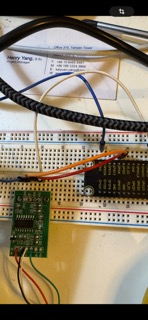

# Modulor Hardware Samples
=====================================

Hello David, Hello Students,

Below are the hardware examples that you may need to get started with your project.

## Buttons and LEDs
--------------------

In the `button_led.py` file, you'll find simple examples of how to control pins and buttons using the GPIOZERO library.

### Example Use Cases

* Controlling LEDs with GPIOZERO
* Reading button inputs with GPIOZERO

## Relay Control
----------------

The usage of relays is similar to LEDs, with the only difference being the initial setup for the pins. Relays require the pins to be initialized as ground and down, as they only recognize the negative value via ground to switch from NC (normally closed) to open.

### Important Notes

* Initialize relay pins as ground and down
* Relays only recognize negative values via ground

## Scale Sample
----------------

In the `scale_sample` file, you'll find an example of how to use the scale and get precise values out of it. Please refer to the comments in the code for more information.

### Scale Setup

### Example Use Cases

* Reading precise values from the scale
* Using the scale with GPIOZERO